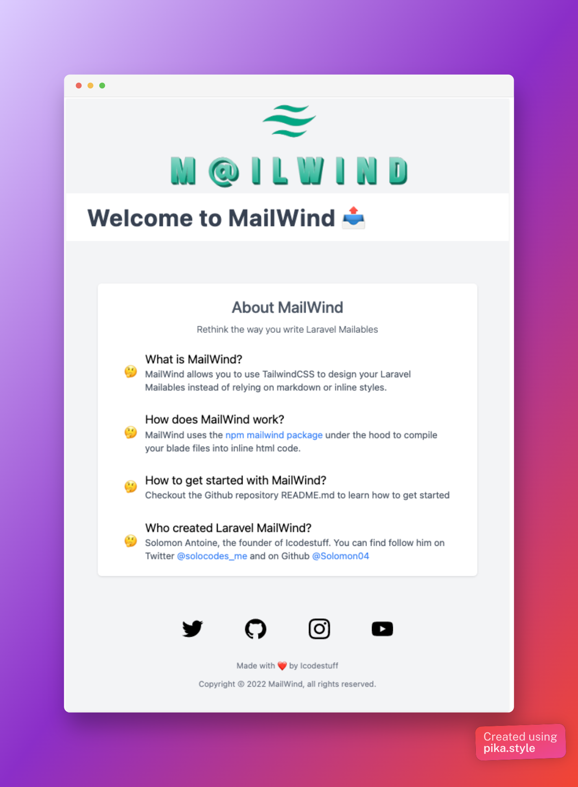

<p align="center"></p>
<p align="center">
<a href="https://packagist.org/packages/icodestuff/mailwind"></a>
<a href="https://packagist.org/packages/bensampo/laravel-enum"></a>
<a href="https://github.com/icodestuff-io/laravel-mailwind/actions?query=workflow%3A'Fix+PHP+code+style+issues'+branch%3Amain'"></a>
<a href="https://packagist.org/packages/icodestuff/mailwind"></a>
</p>



## About Laravel MailWind
Use TailwindCSS to design your Laravel Mailables instead of relying on markdown or inline styles.


## Installation

You can install the package via composer:

```bash
composer require icodestuff/laravel-mailwind
```

You can publish and run the migrations with:


You can publish the config file with:

```bash
php artisan vendor:publish --tag="maiwlind-config"
```

This is the contents of the published config file:

```php
return [
];
```

Optionally, you can publish the views using

```bash
php artisan vendor:publish --tag=":package_slug-views"
```

## Usage

## Testing

```bash
composer test
```

## Changelog

Please see [CHANGELOG](CHANGELOG.md) for more information on what has changed recently.

## Credits

- [Solomon Antoine](https://github.com/solomon04)

## License

The MIT License (MIT). Please see [License File](LICENSE.md) for more information.

## TODO
- [ ] Write test cases
- [ ] Test in Real Laravel application
- [ ] Document setup process
