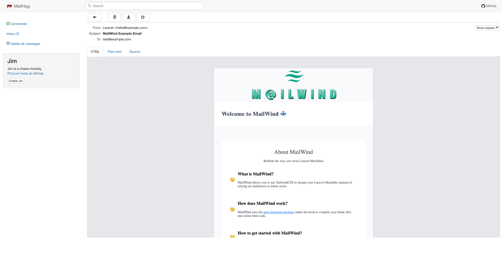

<p align="center"></p>
<p align="center">
<a href="https://packagist.org/packages/icodestuff/laravel-mailwind"></a>
<a href="https://packagist.org/packages/icodestuff/laravel-mailwind"></a>
<a href="https://github.com/icodestuff-io/laravel-mailwind/actions?query=workflow%3A'Fix+PHP+code+style+issues'+branch%3Amain'"></a>
<a href="https://packagist.org/packages/icodestuff/laravel-mailwind"></a>
</p>

## About Laravel Mailwind
Use TailwindCSS to design your Laravel Mailables instead of relying on markdown or inline styles. **NOTE after testing this package on multiple email clients, I am sad to announce it'll likely never be production ready 😢**

#### Requires
- Laravel 9
- TailwindCSS


## Installation

You can install the package via composer:

```bash
composer require icodestuff/laravel-mailwind
```

You need to publish the views with:

```bash
php artisan vendor:publish --tag="mailwind-views"
```

## Getting Started
### Create a template 
By default, Mailwind exports an example template called: `mailwind-example-template.blade.php`. 

If you want to create a new template, you can run: 

```bash
php artisan mailwind:create MyTemplate
```
which will generate the file `my-template.blade.php` within `resources/views/vendor/mailwind/templates`.

> In order to use Mailwind, you **MUST** add new templates to the `resources/views/vendor/mailwind/templates`. Note, we don't currently support subdirectories within 
the `templates/` folder.

### Generate mail views
By default, Mailwind picks up on changes to your email template but if you want to regenerate all of your views, you can run the generate command: 

```bash
php artisan mailwind:generate
```

which will generate compiled views within the `resources/views/vendor/mailwind/generated` directory.  Note,
all generated files are ignored by git, so it is recommended to run the `php artisan mailwind:generate` in your deployment scripts similar to
`npm run prod`. 


### Prepare your Mailable
Generate a new Laravel mailable by running: 

```bash 
php artisan make:mail YourMailable
```

Then associate Mailwind with a mailable by implementing the trait `InteractsWithMailWind` like so:
~~~php 
namespace App\Mail;

use Icodestuff\Mailwind\Traits\InteractsWithMailWind;
use Illuminate\Bus\Queueable;
use Illuminate\Contracts\Queue\ShouldQueue;
use Illuminate\Mail\Mailable;
use Illuminate\Queue\SerializesModels;

class YourMailable extends Mailable 
{

    use Queueable, SerializesModels, InteractsWithMailWind;
}
~~~

Then within the build method, use the template that we created within the `resources/views/vendor/mailwind/templates` directory
like so: 
~~~php 
/**
 * Build the message.
 *
 * @return $this
 */
public function build()
{
    return $this->view('mailwind::templates.my-template') // maps to: resources/views/vendor/mailwind/templates/my-template.blade.php
        ->subject('Mailwind Example Email');
}
~~~

### Send the Mailable
Run `php artisan tinker` then paste

```bash  
Mail::to('test@example.com')->send(new App\Mail\YourMailable())
```

to send out your email. If you are using Mailhog, you can visit http://localhost:8025/ to see the email: 


## Testing

```bash
composer test
```

## Changelog

Please see [CHANGELOG](CHANGELOG.md) for more information on what has changed recently.

## Credits

- [Solomon Antoine](https://github.com/solomon04)

## License

The MIT License (MIT). Please see [License File](LICENSE.md) for more information.
